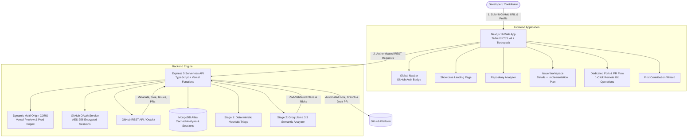

# 🌊 ContribFlow

<p align="center">
  <strong>The Deterministic AI-Powered Open Source Contribution Engine</strong>
</p>

<p align="center">
  <em>Turn "I want to contribute to open source" into "I analyzed the codebase, picked the perfect issue, bootstrapped my environment, and opened a draft PR in minutes."</em>
</p>

<p align="center">
  <a href="https://frontend-omega-orcin-vbz2no3hdc.vercel.app"></a>
  <a href="https://backend-sand-two-sj4tr3ssi2.vercel.app/health"></a>
  <a href="https://github.com/manasshete/contribflow"></a>
</p>

<p align="center">
  
  
  
  
  
  
  
  
  
  
</p>

---

## 💡 The Problem ContribFlow Solves

Millions of aspiring developers want to contribute to open source, yet over **80% give up before submitting their first pull request**:

| The Friction | What Happens Today | How ContribFlow Solves It |
|---|---|---|
| **Repository Intimidation** | Huge, monolithic directories with thousands of unfamiliar files. | **Zero-Clone Analysis** inspects entry points, tech stack, and test setup in seconds. |
| **Misleading Issue Labels** | Stale `good first issue` tags that require deep architectural context. | **Two-Stage Filtering** filters out bot spam and scores true difficulty. |
| **Context Paralysis** | Not knowing which file to edit or where the bug originates. | **File-by-File Blueprint** pinpoints exact files, relevant symbols, and risks. |
| **Setup Friction** | Wrestling with git commands, remotes, fork syncing, and dependencies. | **Dev Toolkit** gives you one-click shell commands tailored to the repo. |
| **PR Hesitation** | Fear of improper PR descriptions or incorrect branch naming. | **One-Click Fork & PR Flow** creates the branch and opens a drafted PR for you. |

---

## 🚀 Complete Feature Overview

### 1. 🔍 Zero-Clone Repository Intelligence
- Inspects any public GitHub repository on demand using the GitHub REST API without heavy cloning.
- Automatically detects:
  - **Technology Stacks**: Runtimes, package managers (`npm`, `pnpm`, `yarn`), and primary languages.
  - **Architecture Models**: Client-server, monorepo, CLI utility, library, or full-stack application.
  - **Pivotal Files**: Entry points (`src/index.ts`, `main.go`), configuration files, and test suites.
  - **Repository Health**: Active commits, open issues ratio, contributor activity, and licensing.

### 2. ⚡ Two-Stage Scalable Issue Triage
- **Stage 1 (Deterministic Heuristic Filtering)**:
  - Instantly evaluates hundreds of open issues.
  - Filters out bot-generated alerts, automated dependency bumps, stale threads, and spam.
  - Extracts key signals: comments, labels, maintainer responsiveness, and age.
- **Stage 2 (AI Semantic Calibration)**:
  - Sends top-tier candidates to Groq (powered by **Llama 3.3**) for structured, Zod-validated evaluation.
  - Evaluates domain complexity, estimated hours, and prerequisite skills.

### 3. 🎯 Transparent Hybrid Recommendation Engine
- Scores issues on a **0–100 match scale** customized to your profile:
  - **Skill Alignment**: Direct overlap between your proficiencies and the issue's requirements.
  - **Experience Calibration**: Calibrated for *Beginner*, *Intermediate*, or *Advanced* comfort levels.
  - **Time Feasibility**: Filters out multi-week tasks when you only have a few hours.
  - **Historical PR Complexity**: Inspects previously merged pull requests touching similar modules.
- Delivers an explicit breakdown: *"Why is this issue recommended for you?"*

### 4. 🗺️ File-by-File Contribution Blueprints
- Generates an actionable, structured implementation guide:
  - **Exact Affected Files**: Ranked by relevance with reasons for inspection.
  - **Key Symbols & Dependencies**: Functions, classes, and packages to focus on.
  - **Step-by-Step Checklist**: Phased tasks from initial branch to validation.
  - **Testing Strategy**: Which test suites to run (`npm test`, `jest`, `pytest`).
  - **Architectural Risks**: Edge cases and regressions to keep in mind.

### 5. 🛠️ Developer Workspace Bootstrapper & PR Generator
- **Local Bootstrapper**: Generates exact terminal commands for your terminal:
  - Clones your fork
  - Adds the original repository as `upstream`
  - Creates the recommended branch (e.g. `feat/issue-2756`)
  - Installs dependencies using the repository's detected package manager
- **PR Description Generator**:
  - Automatically identifies existing PR templates (`.github/PULL_REQUEST_TEMPLATE.md`, etc.).
  - Fills out template sections with issue context, solution summary, and validation steps.
  - Provides instant copy buttons for both PR Title and PR Body.

### 6. ⚡ One-Click GitHub OAuth & Automated Fork / PR
- **GitHub OAuth 2.0 Integration**:
  - Secure authentication with encrypted access token storage (`AES-256-GCM`).
  - Cross-site HttpOnly session cookies with JWT verification.
  - Real-time GitHub session badge in the global navigation bar showing your avatar and `@username`.
- **Dedicated Fork & PR Workflow** (`/repository/[owner]/[repo]/issues/[issueNumber]/actions`):
  - **Step 1**: Automatically fork the target repository to your GitHub account with one click.
  - **Step 2**: Create the feature branch directly on your remote fork via the GitHub API.
  - **Step 3**: Open a pre-populated draft pull request against the upstream repository without leaving ContribFlow!

### 7. 🧙 First Contribution Interactive Wizard
- A friendly, 5-step guided journey designed for beginners:
  1. **Orientation**: Understand the project scope and contribution guidelines.
  2. **Profile Calibration**: Define languages and hours available.
  3. **Issue Discovery**: Pick from tailored, scored recommendations.
  4. **Codebase Exploration**: Review affected files and historical merged PRs.
  5. **Submission Prep**: Check off contribution requirements and prepare your PR.

---

## 🏗️ System Architecture



---

## 🛠️ Technology Stack

### Frontend
- **Framework**: [Next.js 16](https://nextjs.org/) (App Router, Turbopack, SSR + Client Components)
- **UI Library**: [React 19](https://react.dev/)
- **Styling**: [Tailwind CSS v4](https://tailwindcss.com/) with modern CSS tokens, dark mode, and glassmorphic designs
- **Icons**: [Lucide React](https://lucide.dev/)
- **Data Fetching & Cache**: [SWR](https://swr.vercel.app/) with optimistic mutations

### Backend
- **Framework**: [Express 5](https://expressjs.com/) on [Node.js 20+](https://nodejs.org/)
- **Language**: [TypeScript](https://www.typescriptlang.org/)
- **GitHub Integration**: [@octokit/rest](https://github.com/octokit/rest.js) (ESM dynamic loader)
- **AI Engine**: [Groq Cloud](https://groq.com/) with Llama 3.3 70B Versatile
- **Schema Validation**: [Zod](https://zod.dev/) for strict runtime type enforcement
- **Security**: [Helmet](https://helmetjs.github.io/), rate limiting (`express-rate-limit`), cookie encryption
- **Database**: [MongoDB](https://www.mongodb.com/) via Mongoose with automatic reconnection

### Cloud & Deployment
- **Frontend Hosting**: [Vercel](https://vercel.com/) (Edge CDN + Static Optimization)
- **Backend Hosting**: [Vercel Serverless Functions](https://vercel.com/)
- **Database**: [MongoDB Atlas](https://www.mongodb.com/atlas)

---

## 📂 Repository Structure

```text
contribflow/
├── backend/
│   ├── api/
│   │   ├── health.ts               # Fast health check serverless function
│   │   └── index.ts                # Main Express serverless entrypoint
│   ├── src/
│   │   ├── config/
│   │   │   └── env.ts              # Zod environment schema & dynamic CORS validator
│   │   ├── controllers/
│   │   │   ├── auth.controller.ts  # GitHub OAuth start, callback, user info, logout
│   │   │   ├── github-actions.controller.ts # Remote fork, branch, draft PR handlers
│   │   │   ├── issue.controller.ts # Issue detail, AI analyzer, toolkit handler
│   │   │   └── repository.controller.ts # Deep repository analysis handler
│   │   ├── middleware/
│   │   │   ├── auth.ts             # JWT session verification & GitHub token decrypter
│   │   │   ├── errorHandler.ts     # Global AppError & Zod validation handler
│   │   │   └── rateLimiter.ts      # Tiered rate limits (general vs heavy AI calls)
│   │   ├── models/                 # Mongoose schemas (User, Repo, Issue, Wizard)
│   │   ├── routes/                 # Express API routes
│   │   ├── services/
│   │   │   ├── github/             # Octokit client & OAuth services
│   │   │   ├── issue/              # Filtering, PR complexity analysis & blueprints
│   │   │   ├── recommendation/     # Hybrid scoring & ranking algorithms
│   │   │   └── repository/         # Tech stack & entry point analyzer
│   │   ├── utils/                  # AES-256 encryption, session JWT signing
│   │   └── index.ts                # Express app setup, CORS & Helmet configuration
│   ├── package.json
│   ├── tsconfig.json
│   └── vercel.json                 # Backend rewrite rules for Vercel
│
├── frontend/
│   ├── src/
│   │   ├── app/
│   │   │   ├── analyze/            # Repository input & progress view
│   │   │   ├── repository/
│   │   │   │   └── [owner]/[repo]/
│   │   │   │       ├── issues/
│   │   │   │       │   ├── page.tsx               # Issue discovery & filters
│   │   │   │       │   └── [issueNumber]/
│   │   │   │       │       ├── page.tsx           # Contribution workspace
│   │   │   │       │       └── actions/page.tsx   # Dedicated One-Click Fork & PR page
│   │   │   │       ├── first-contribution/        # 5-step interactive wizard
│   │   │   │       └── page.tsx                   # Repository architecture overview
│   │   │   ├── layout.tsx          # Root layout with font optimization & theme
│   │   │   └── page.tsx            # Modern hero, features & live showcase
│   │   ├── components/
│   │   │   ├── analyze/            # URL analyzer forms & status steppers
│   │   │   ├── first-contribution/ # Wizard steps & progress tracker
│   │   │   ├── issues/             # Match-score badges & issue cards
│   │   │   ├── layout/             # Top Navbar (with GitHub badge) & Footer
│   │   │   ├── repository/         # Tech badges, entry files & architecture map
│   │   │   ├── ui/                 # Reusable buttons, alerts, badges
│   │   │   └── workspace/          # Contribution guide, toolkit, and Fork/PR panels
│   │   ├── lib/
│   │   │   └── api.ts              # Strongly typed API client with credentials support
│   │   └── types/                  # Shared TypeScript models and API types
│   ├── package.json
│   ├── tsconfig.json
│   └── next.config.ts
│
└── README.md
```

---

## 🚦 Getting Started Locally

### Prerequisites
- **Node.js** 20.x or higher
- **npm**, **pnpm**, or **yarn**
- **Git**
- Optional: A [GitHub Personal Access Token](https://github.com/settings/tokens) (for higher API rate limits)
- Optional: A [GitHub OAuth App](https://github.com/settings/developers) (for One-Click Fork & PR)
- A [MongoDB Atlas](https://www.mongodb.com/atlas) connection URI or local MongoDB instance

---

### 1. Clone the Repository
```bash
git clone https://github.com/manasshete/contribflow.git
cd contribflow
```

---

### 2. Configure Backend

```bash
cd backend
npm install
```

Create a `.env` file inside `backend/`:
```env
PORT=4000
NODE_ENV=development
FRONTEND_URL=http://localhost:3000
MONGODB_URI=mongodb+srv://<user>:<password>@cluster0.mongodb.net/contribflow

# GitHub Personal Access Token (for Octokit rate limits)
GITHUB_TOKEN=ghp_your_github_token_here

# GitHub OAuth App (Optional - enables One-Click Fork & PR)
GITHUB_OAUTH_CLIENT_ID=your_client_id
GITHUB_OAUTH_CLIENT_SECRET=your_40_char_client_secret
GITHUB_OAUTH_REDIRECT_URI=http://localhost:4000/api/auth/github/callback

# Security Keys (Generate 64-char hex strings with crypto.randomBytes(32).toString('hex'))
SESSION_SECRET=your_session_secret_hex
TOKEN_ENCRYPTION_KEY=your_token_encryption_key_hex
```

Start the backend:
```bash
npm run dev
```
Backend will be live at `http://localhost:4000`. Test via:
```bash
curl http://localhost:4000/health
```

---

### 3. Configure Frontend

Open a second terminal window:
```bash
cd frontend
npm install
```

Create a `.env.local` file inside `frontend/`:
```env
NEXT_PUBLIC_API_URL=http://localhost:4000
```

Start the frontend development server:
```bash
npm run dev
```

Open **[http://localhost:3000](http://localhost:3000)** in your browser.

---

## 📡 API Reference

### Health & Repositories
| Method | Endpoint | Description |
| :--- | :--- | :--- |
| `GET` | `/health` | API and MongoDB connection health check |
| `POST` | `/api/repositories/analyze` | Initiates deep repository analysis (`{ url }`) |
| `GET` | `/api/repositories/:owner/:repo` | Retrieves cached repository profile, tech stack & architecture |
| `GET` | `/api/repositories/:owner/:repo/issues` | Fetches filtered open issues with candidate scores |

### Issues, Plans & Recommendations
| Method | Endpoint | Description |
| :--- | :--- | :--- |
| `POST` | `/api/recommendations` | Computes tailored issue recommendations for a developer profile |
| `GET` | `/api/issues/:owner/:repo/:issueNumber` | Fetches detailed issue data, labels, and comments |
| `POST` | `/api/issues/:owner/:repo/:issueNumber/analyze` | Generates a structured contribution blueprint & affected files |
| `GET` | `/api/issues/:owner/:repo/:issueNumber/toolkit` | Returns local bootstrap commands & template-filled PR description |

### GitHub OAuth & 1-Click Git Actions
| Method | Endpoint | Description |
| :--- | :--- | :--- |
| `GET` | `/api/auth/github` | Initiates GitHub OAuth 2.0 authorization redirect |
| `GET` | `/api/auth/github/callback` | Exchanges authorization code for encrypted user access token |
| `GET` | `/api/auth/me` | Returns active user session (`{ connected: true, login, avatarUrl }`) |
| `POST` | `/api/auth/logout` | Clears authentication session cookie |
| `POST` | `/api/github/fork` | Forks upstream repository to connected user account |
| `POST` | `/api/github/branch` | Creates a feature branch on user's remote fork |
| `POST` | `/api/github/draft-pr` | Opens a draft pull request with generated title & body |

### First Contribution Wizard
| Method | Endpoint | Description |
| :--- | :--- | :--- |
| `GET` | `/api/repositories/:owner/:repo/first-contribution` | Gets active contribution wizard session |
| `POST` | `/api/repositories/:owner/:repo/first-contribution/profile` | Submits developer skill profile for wizard |
| `POST` | `/api/repositories/:owner/:repo/first-contribution/issue` | Selects target issue and attaches contribution blueprint |
| `PATCH`| `/api/first-contribution/:id/progress` | Updates completion checklist progress |

---

## 🔒 Security & CORS Architecture

ContribFlow incorporates production-grade security practices:

- **Dynamic Multi-Origin CORS**: Backend automatically permits requests from `localhost`, configured custom domains, and any Vercel deployment preview URL matching `/^https:\/\/([a-zA-Z0-9_-]+\.)*vercel\.app$/`.
- **Zero-Storage of Plaintext Tokens**: User GitHub access tokens are encrypted with `AES-256-GCM` before persisting to MongoDB and decrypted only in-memory when performing user-authorized git operations.
- **Secure HttpOnly Cookies**: Auth session cookies use `SameSite=None`, `Secure=true`, and `HttpOnly` in production to prevent XSS and cross-site leaks.
- **Tiered Rate Limiting**: General endpoints allow 60 req/min; resource-heavy repository analyses and AI generation endpoints are throttled to 30 req/min with automatic proxy IP trust.

---

## ☁️ Deployment

### Live Production Endpoints
- **Frontend App**: [https://frontend-omega-orcin-vbz2no3hdc.vercel.app](https://frontend-omega-orcin-vbz2no3hdc.vercel.app)
- **Backend API**: [https://backend-sand-two-sj4tr3ssi2.vercel.app](https://backend-sand-two-sj4tr3ssi2.vercel.app)

### Deploying to Vercel
Both modules can be independently deployed using the Vercel CLI:

```bash
# 1. Deploy Backend to Vercel Production
cd backend
npx vercel --prod

# 2. Deploy Frontend to Vercel Production
cd ../frontend
npx vercel --prod
```

---

## 🤝 Contributing

We welcome contributions of all levels! To contribute:

1. **Fork** the repository using the [ContribFlow One-Click Flow](https://frontend-omega-orcin-vbz2no3hdc.vercel.app) or manually.
2. **Create** a branch: `git checkout -b feat/amazing-feature`.
3. **Commit** your changes: `git commit -m "feat: add amazing feature"`.
4. **Push** to your fork: `git push origin feat/amazing-feature`.
5. **Open** a Pull Request against `main`.

---

## 📄 License

This project is open source and available under the **[MIT License](LICENSE)**.

<p align="center">
  Crafted with ❤️ for open source contributors worldwide by <a href="https://github.com/manasshete"><strong>Manas Shete</strong></a>
</p>
