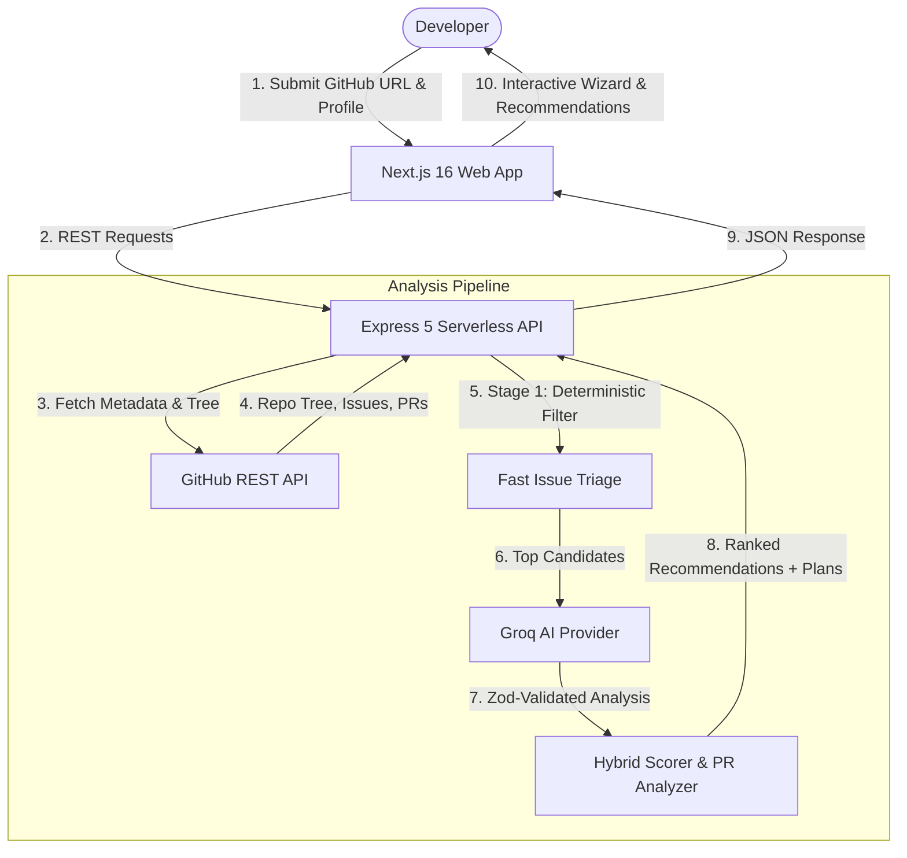

# 🌊 ContribFlow

<p align="center">
  <strong>AI-Powered Open Source Contribution Assistant</strong>
</p>

<p align="center">
  <em>Turn "I want to contribute to open source" into "I found an issue, understand the codebase, and have a clear implementation plan."</em>
</p>

<p align="center">
  <a href="https://frontend-omega-orcin-vbz2no3hdc.vercel.app"></a>
  <a href="https://backend-sand-two-sj4tr3ssi2.vercel.app/health"></a>
  <a href="https://github.com/manasshete/contribflow"></a>
</p>

<p align="center">
  
  
  
  
  
  
  
  
</p>

---

## 💡 The Problem

Millions of developers want to participate in open source, but are stopped by recurring barriers:
- **Repository Intimidation**: Complex folder structures and thousands of lines of unfamiliar code.
- **Label Inaccuracy**: `good first issue` tags are often stale, abandoned, or deceptively complicated.
- **Context Paralysis**: Not knowing which files to inspect, where entry points live, or how tests are run.
- **Skill Mismatch**: Picking an issue that requires domain knowledge outside their current background or available time.
- **PR Anxiety**: Fear of making architectural errors or submitting poor pull requests.

**ContribFlow eliminates this friction.** Provide any public GitHub repository and your skill profile to receive tailored, scored issue recommendations with concrete implementation plans.

---

## ✨ Key Features

### 🔍 1. Zero-Clone Repository Intelligence
- Analyzes GitHub repositories on-demand via the GitHub REST API without heavy cloning.
- Detects technology stacks, programming languages, build configurations, and architecture models (monorepo, client-server, CLI, library).
- Generates repository health metrics and identifies pivotal entry files, contribution guides, and test setups.

### ⚡ 2. Two-Stage Scalable Issue Filtering
- **Stage 1 (Deterministic Filtering)**: Evaluates hundreds of open issues instantly based on state, bot activity, spam filters, age, comment engagement, and label markers.
- **Stage 2 (AI Semantic Analysis)**: Routes only the top candidate issues through Groq (Llama 3.3) for structured schema-validated evaluation via Zod.

### 🎯 3. Explainable Hybrid Recommendation Engine
- Scores issues on a transparent 0–100 match scale based on:
  - **Skill Alignment**: Match between developer technologies and issue requirements.
  - **Experience Calibration**: Tailored to Beginner, Intermediate, or Advanced comfort levels.
  - **Time Feasibility**: Calibrated against your available hours.
  - **Historical PR Complexity**: Inspects recent merged PRs touching similar files to prevent hidden roadblocks.
- Delivers a clear breakdown answering: *"Why is this issue recommended for you?"*

### 🗺️ 4. Actionable Contribution Blueprints
- Identifies specific target files, configuration points, and test suites needing changes.
- Outlines phased implementation steps from branch creation to test validation.
- Flags project-specific risks and architectural considerations before writing code.

### 🧙 5. Interactive First Contribution Wizard
- A guided end-to-end multi-step workflow:
  1. **Repository Orientation**: Understand project scope and requirements.
  2. **Developer Profile**: Enter your language proficiencies and available time.
  3. **Issue Discovery & Selection**: Filter and select from ranked recommendations.
  4. **Codebase Exploration**: Review affected modules and historical pull requests.
  5. **PR Preparation & Checklist**: Validate contribution guidelines and prepare your submission.

---

## 🏗️ Architecture & Workflow



---

## 🛠️ Tech Stack

### Frontend
- **Framework**: [Next.js 16](https://nextjs.org/) (App Router, Turbopack, Server-Side Rendering)
- **Library**: [React 19](https://react.dev/)
- **Styling**: [Tailwind CSS v4](https://tailwindcss.com/) with modern CSS tokens and dark mode
- **UI Components**: Radix / Base UI primitives, Lucide Icons
- **State & Data Fetching**: [SWR](https://swr.vercel.app/) with caching and optimistic revalidation

### Backend & API
- **Runtime**: [Node.js 20+](https://nodejs.org/) & [Express 5](https://expressjs.com/)
- **Language**: [TypeScript](https://www.typescriptlang.org/)
- **API Integration**: [@octokit/rest](https://github.com/octokit/rest.js) (dynamic ESM loader)
- **Validation**: [Zod](https://zod.dev/) for strict runtime schema validation
- **Security**: [Helmet](https://helmetjs.github.io/), CORS policies, rate limiting (`express-rate-limit`)
- **Database**: [MongoDB](https://www.mongodb.com/) via Mongoose (with connection pooling)
- **Deployment Platform**: [Vercel](https://vercel.com/) (Serverless API Functions & Edge Network)

---

## 📂 Project Structure

```
contribflow/
├── backend/
│   ├── api/                     # Vercel serverless entrypoints
│   │   ├── health.ts            # Fast health check route
│   │   └── index.ts             # Serverless Express adapter
│   ├── src/
│   │   ├── config/              # Environment and runtime configurations
│   │   ├── controllers/         # Request handlers for repos, issues, recommendations
│   │   ├── lib/                 # Database connection & shared utilities
│   │   ├── middleware/          # Rate limiting, error handling, not-found handlers
│   │   ├── models/              # Mongoose database models
│   │   ├── routes/              # Express API route modules
│   │   ├── services/
│   │   │   ├── github/          # Octokit integration & file prioritization
│   │   │   ├── issue/           # Filtering, PR complexity analysis & plans
│   │   │   ├── recommendation/  # Hybrid scoring & ranking algorithms
│   │   │   └── repository/      # Repository intelligence analyzer
│   │   └── index.ts             # Express application initialization
│   ├── package.json
│   ├── tsconfig.json
│   └── vercel.json              # Backend Vercel serverless routing
│
├── frontend/
│   ├── src/
│   │   ├── app/                 # Next.js App Router pages
│   │   │   ├── analyze/         # Analyze input page
│   │   │   ├── repository/      # Repository view, issues & wizard
│   │   │   ├── layout.tsx       # Root layout & design wrapper
│   │   │   └── page.tsx         # Modern landing page & showcase
│   │   ├── components/
│   │   │   ├── analyze/         # Interactive analysis forms
│   │   │   ├── first-contribution/ # Multi-step contribution wizard
│   │   │   ├── issues/          # Recommendation cards & filters
│   │   │   ├── layout/          # Navigation, header, and footer
│   │   │   └── repository/      # Overview, metrics & architecture
│   │   ├── lib/                 # API client & helper utilities
│   │   └── types/               # TypeScript interfaces & types
│   ├── package.json
│   ├── tsconfig.json
│   └── next.config.ts
│
└── README.md
```

---

## 🚦 Getting Started Locally

### Prerequisites
- **Node.js** 20.x or higher
- **npm**, **pnpm**, or **yarn**
- **Git**
- Optional: A [GitHub Personal Access Token](https://github.com/settings/tokens) (for higher API rate limits)
- Optional: A [MongoDB Atlas](https://www.mongodb.com/atlas) connection string (local fallback supported)

---

### 1. Clone the Repository
```bash
git clone https://github.com/manasshete/contribflow.git
cd contribflow
```

---

### 2. Configure Backend
```bash
cd backend
npm install
```

Create a `.env` file inside `backend/`:
```env
PORT=4000
NODE_ENV=development
MONGODB_URI=mongodb://localhost:27017/contribflow
# Optional: Higher GitHub API limit
GITHUB_TOKEN=ghp_your_github_personal_access_token_here
```

Start the backend in development mode:
```bash
npm run dev
```
Backend will be live at `http://localhost:4000`. Test via:
```bash
curl http://localhost:4000/health
```

---

### 3. Configure Frontend
Open a new terminal window:
```bash
cd ../frontend
npm install
```

Create a `.env.local` file inside `frontend/`:
```env
NEXT_PUBLIC_API_URL=http://localhost:4000
```

Start the Next.js development server:
```bash
npm run dev
```
Open [http://localhost:3000](http://localhost:3000) in your browser.

---

## 📡 API Reference

| Method | Endpoint | Description |
| :--- | :--- | :--- |
| `GET` | `/health` | Server and database health check |
| `POST` | `/api/repositories/analyze` | Initiates deep repository analysis (`{ url }`) |
| `GET` | `/api/repositories/:owner/:repo` | Retrieves cached repository profile & architecture |
| `GET` | `/api/repositories/:owner/:repo/issues` | Fetches filtered open issues with candidate scores |
| `POST` | `/api/recommendations` | Computes ranked issue recommendations for a developer profile |
| `GET` | `/api/issues/:owner/:repo/:issueNumber` | Fetches detailed issue data, labels, and comments |
| `POST` | `/api/issues/:owner/:repo/:issueNumber/analyze` | Generates contribution plan & affected file recommendations |
| `GET` | `/api/repositories/:owner/:repo/first-contribution` | Gets active contribution wizard session |
| `POST` | `/api/repositories/:owner/:repo/first-contribution/profile` | Submits developer skill profile for wizard |
| `POST` | `/api/repositories/:owner/:repo/first-contribution/issue` | Selects target issue and generates guide |
| `PATCH`| `/api/first-contribution/:id/progress` | Updates completion checklist progress |

---

## ☁️ Deployment

### Deployed Environments
- **Frontend Web App**: [https://frontend-omega-orcin-vbz2no3hdc.vercel.app](https://frontend-omega-orcin-vbz2no3hdc.vercel.app)
- **Backend API**: [https://backend-sand-two-sj4tr3ssi2.vercel.app](https://backend-sand-two-sj4tr3ssi2.vercel.app)

### Deploying with Vercel CLI
Both modules can be deployed independently to Vercel:

```bash
# Deploy Backend
cd backend
npx vercel --prod

# Deploy Frontend
cd ../frontend
npx vercel --prod
```

---

## 🤝 Contributing

We welcome contributions to ContribFlow! To contribute:
1. **Fork** the repository.
2. **Create** a feature branch: `git checkout -b feature/amazing-feature`.
3. **Commit** your changes: `git commit -m "feat: add amazing feature"`.
4. **Push** to the branch: `git push origin feature/amazing-feature`.
5. **Open** a Pull Request.

---

## 📄 License

This project is licensed under the **MIT License**. See [LICENSE](LICENSE) for details.

<p align="center">
  Built with ❤️ for the open-source community by <a href="https://github.com/manasshete">Manas Shete</a>
</p>
